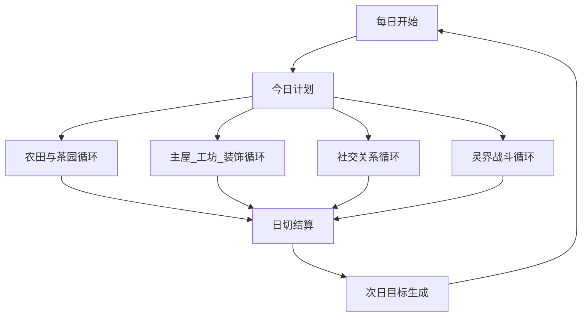

# 【执行稿】云海山庄 7天/28天留存循环设计（V1）

## 1. 目标与范围

- 目标：用现有已实现系统，形成可验证的 7 天与 28 天留存循环。
- 范围：仅使用当前代码已落地能力，不引入“尚未开发完成”的大系统。
- 覆盖系统：
  - 日切主入口：`GameRuntime::OnDayChanged()` / `GameRuntime::SleepToNextMorning()`
  - 经营：主屋升级、工坊、茶园分层、客栈、畜棚、装饰经营联动
  - 社交：关系状态机（告白/婚礼/婚后 buff）+ 对话注入
  - 探索：灵界战斗触发、奖励回流经营
  - 存档：版本/校验/兼容迁移

## 2. 留存循环总图（现有系统版）

## 3. 7天留存循环（D1-D7）

### D1-D2：建立“可完成感”

- 玩家心智：我每天做 3-4 件事，都有可见回报。
- 系统承载：
  - 农田基础循环（播种/浇水/收获）
  - NPC 交谈与送礼（好感可见提升）
  - 日切汇总通知（云海、客栈、畜棚、舒适度、病虫害）
- 验收标准：
  - 新档前两天至少触发 2 次日切汇总
  - D2 结束时可见 1 项“比昨天更强”的变化（库存/金币/好感/产出）

### D3-D4：建立“系统互相增益”

- 玩家心智：不是单点重复，而是一个行为会影响多个系统。
- 系统承载：
  - 装饰评分 -> 客栈来访权重/畜棚产量/舒适度 buff
  - 工坊加工输出 -> 经营收益加速
  - 茶园专属地块成长加成
- 验收标准：
  - D4 前玩家可观察到一次“跨系统联动收益”（例如装饰影响客栈/畜棚）
  - D4 前至少完成一次工坊加工领取

### D5-D7：建立“中期目标牵引”

- 玩家心智：我不只是在过今天，而是在推进一个阶段目标。
- 系统承载：
  - 主屋升级目标（与工坊/温室解锁联动）
  - 关系推进目标（告白条件/婚礼预约）
  - 灵界探索目标（战斗奖励回流经营）
- 验收标准：
  - D7 前形成至少 1 个中期目标承诺（主屋下一阶/婚礼预约/灵界层推进）
  - D7 存档后读档，关键状态无丢失（关系、客栈、畜棚、装饰、周统计）

## 4. 28天留存循环（W1-W4）

> 设计原则：每周一个“主题推进”，每周末有可见结算。

### W1（D1-D7）：生存与熟悉

- 核心目标：形成稳定日程（种田 + 社交 + 基础经营）。
- 周末可见结果：
  - 首次稳定现金流
  - 至少 1 个经营面板数据持续上升（客栈来访/畜棚产出/装饰评分）

### W2（D8-D14）：效率与升级

- 核心目标：主屋升级与工坊效率收益开始显著。
- 周末可见结果：
  - 主屋升级进度推进
  - 工坊产出开始成为固定收益来源

### W3（D15-D21）：关系与身份

- 核心目标：关系状态机推进到“可告白/订婚/婚礼预约”区间。
- 周末可见结果：
  - 至少 1 条关系线进入中高阶段
  - 婚后增益或预约目标可见

### W4（D22-D28）：经营闭环固化

- 核心目标：经营系统互相喂养，形成“自驱增长”。
- 周末可见结果：
  - 客栈/畜棚/工坊至少两条线同时正增长
  - 日切汇总可解释 80% 以上收益来源

## 5. 指标与埋点（MVP可执行）

## 5.1 7天关键指标

- D1->D2 次留：是否完成至少 1 次睡眠 + 1 次日切结算
- D3 留存：是否发生过跨系统联动收益（装饰影响客栈或畜棚）
- D7 留存：是否存在中期目标承诺（主屋/关系/灵界任一）

## 5.2 28天关键指标

- W1 完成率：首次稳定现金流达成
- W2 完成率：主屋升级推进 + 工坊输出领取
- W3 完成率：关系线推进到中高阶段
- W4 完成率：经营双引擎（至少两个系统）同时增长

## 5.3 建议事件名（先日志化，后埋点化）

- `retention_day_cycle_completed`
- `retention_cross_system_gain`
- `retention_midterm_goal_committed`
- `retention_weekly_summary_generated`

## 6. 与现有代码的直接映射

- 日切权威入口：`src/engine/GameRuntime.cpp`
- 经营联动：
  - 客栈：`src/engine/systems/InnSystem.cpp`
  - 畜棚：`src/engine/systems/CoopSystem.cpp`
  - 装饰：`src/engine/systems/DecorationSystem.cpp`
  - 工坊：`src/domain/WorkshopSystem.cpp` + `src/engine/systems/WorkshopSystemRuntime.cpp`
- 社交：`src/domain/RelationshipSystem.cpp` + `src/engine/PlayerInteractRuntime.cpp`
- 存档：`src/engine/GameAppSave.cpp` + `src/engine/GameRuntime.cpp`

## 7. 迭代节奏（两周一轮）

- 第1轮（本周）：稳定 7 天循环
  - 固化新手 7 天推荐目标文本（不强制任务）
  - 日切汇总字段补齐（已完成核心项）
- 第2轮（下周）：拉升 28 天中段动力
  - 周报面板（收入来源、经营线贡献、关系推进）
  - 关系与经营联动提示增强（目标感）

## 8. 风险与防回退

- 风险1：新增系统直接插入日切导致顺序漂移
  - 约束：新增每日逻辑必须对齐 `OnDayChanged()` 顺序表
- 风险2：交互层绕过统一入口直接改关键状态
  - 约束：成就、日结、睡眠都走统一入口
- 风险3：文档与实现分离
  - 约束：每次改日切顺序必须同步本文件与 `PROJECT_ROADMAP.md`

## 9. 验收清单（可打勾）

- [ ] 新档连续睡眠 7 天，日切结算无重复/漏算
- [ ] D3 前出现至少一次跨系统增益反馈
- [ ] D7 前形成中期目标承诺
- [ ] D28 前形成双经营引擎正增长
- [ ] 读档后关键留存状态不丢失（关系/客栈/畜棚/装饰/周统计）

